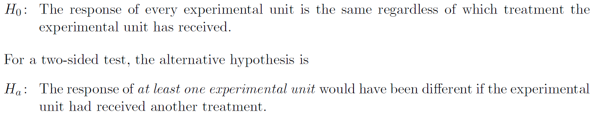
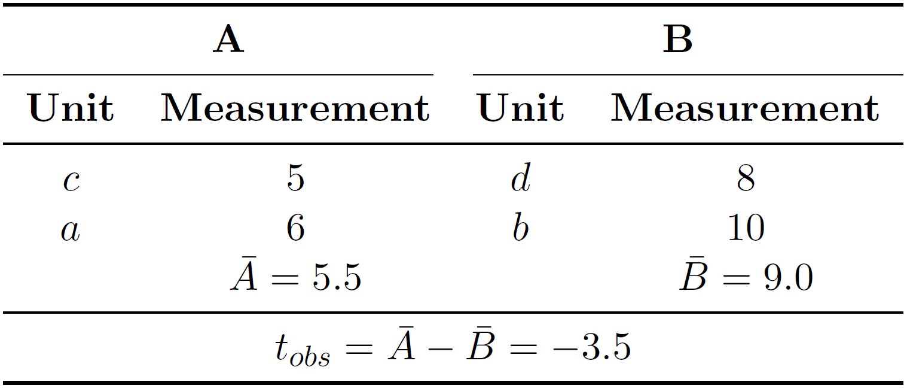
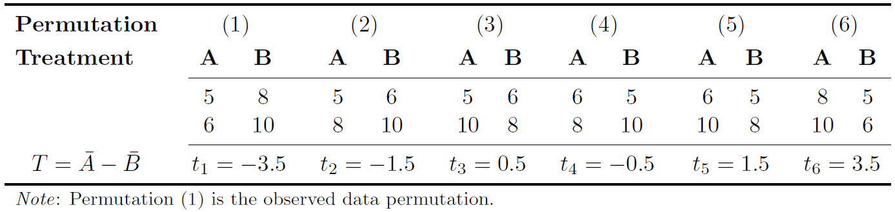
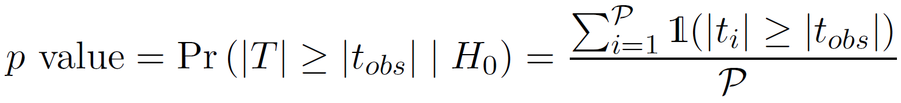

# Randomization tests for two-sample comparison

This Python package implements a randomization test for the comparison of two
independent groups as described in:
> E. Edgington and P. Onghena, Randomization Tests, 4th ed.<br/>
> Boca Raton, FL: Chapman & Hall/CRC, Taylor & Francis Group, 2007.

*Note*: As for the randomization test, it is assumed that the data are originated from a controlled experiment.


## Implementation

### Requirements

* Python 3


### Installation

To install the `randtest` package, run the following on the command line:

```{bash}
$ make install
```

This will `pip` install the package in your activated Python environment.


### Highlights

This implementation demonstrates various aspects of advanced Python programming such as:

* *Packaging*: Creation of a Python package, a collection of Python modules structurally organized, to allow for an easy re-usability of the provided functionality, which is mainly the `randtest()` function.

* *Test-Driven Development (TDD)*: Creation of reliable code with the intended functionality (see `tests/`).

* *Functional Programming*: Passing functions to arguments of `randtest()`, i.e. `mct` and `tstat` (see below).
The former allows passing a user-defined function for the measure of central tendency computed in the test statistic (default: `statistics.mean`).
The latter permits passing a user-defined function for the computation of the test statistic. By default, the difference between measures is computed: `mct(data_group_a) - mct(data_group_b)`.

* *Object-Oriented Programming (OOP)*: The `randtest()` function, for example, returns an instance of the class `randtest.base.RandTestResult`, holding all relevant information of the test result.

* *Generators*: The proper use of Python generators allows for a scalable and memory efficient implementation (i.e., results are processed as they come in).
*Note*: If a user-defined function is passed to `mct`, it requires handling a generator object.

* *Multiprocessing*: Using the `num_jobs` argument permits carrying out the computation over multiple CPUs.
*Note*: Because of it, `randtest()` must be executed below `if __name__ == '__main__':` if a user-defined function is passed to `mct` or `tstat`.

* *Command line interface (CLI)*: Setting up entry points to make functionality available on the CLI (see below).
* *Logging*: Use the `log_level` argument in `randtest()` (or `-l` in the CLI applications).


## Theory: Basic example

This example is taken from:
> E. Stripling, "Distribution-free statistical inference for the comparison of
> central tendencies," <br/>
> MSc thesis, Dept. LStat, KU Leuven, Leuven, Belgium, 2013.

In a randomization test, the hypotheses are as follows:
<p align="center">
    
</p>

Now, suppose we have two treatment groups, **A** and **B**, and four experimental units (designated as *a*, *b*, *c*, and *d*), which are randomly assigned to the two treatment groups.
We conduct the experiment and measure the response of each experimental units.
Assume we observed the following data:
<p align="center">
    
</p>

Our test statistic of interest is the difference between arithmetic means, where _t<sub>obs</sub>_ is the observed test statistic value.
To carry out the randomization test, permute the data and compute the test statistic for each data permutation, which creates the *reference distribution*.
In this example, the *systematic* approach is used, meaning that all possible data permutations are generated.

<p align="center">
    
</p>

Based on the data permutations, the two-sided p value can be computed:

<p align="center">
    
</p>

That is, simply count how often *T* (its absolute value) is equal to or larger than |_t<sub>obs</sub>_| (referring to it as the number of successes), and divide it by the number of generate data permutations.
In this example, the exact two-sided p value equals 2/6 or 33%.

To perform the analysis in Python, use the `randtest()` function with argument `num_permutations=-1` to carry out the systematic approach.

```{python}
>>> from randtest import randtest
>>> x = (5, 6)
>>> y = (8, 10)
>>> result = randtest(x, y, num_permutations=-1)
>>> print(result)
<class 'randtest.base.RandTestResult'>
Method = Systematic
Alternative = two_sided
MCT(data of group A) = 5.5
MCT(data of group B) = 9
Observed test statistic value = -3.5
Number of successes = 2
Number of permutations = 6
p value = 0.333333
seed = None
```

The systematic approach, however, quickly becomes infeasible if the sample size increases.
In this circumstances, the *Monte Carlo randomization test* can be used to approximate the p value.
The `randtest()` function performs a Monte Carlo randomization test by default with `num_permutations=10000` randomly generated data permutations.
As the number of permutations is large, we can make use of multiple CPUs for the computation.
Following, two cores are used by specifying `num_jobs=2` and a seed value is passed to the random number generator for reproducibility.

```{python}
>>> from randtest import randtest
>>> x = (5, 6)
>>> y = (8, 10)
>>> result = randtest(x, y, num_jobs=2, seed=0)
>>> print(result)
<class 'randtest.base.RandTestResult'>
Method = Monte Carlo
Alternative = two_sided
MCT(data of group A) = 5.5
MCT(data of group B) = 9
Observed test statistic value = -3.5
Number of successes = 3312
Number of permutations = 10000
p value = 0.3312
seed = None
```

The p value can be approximated to an arbitrary degree, simply by increasing the number of permutations.


## User-defined function

By default, `randtest()` computes the difference between arithmetic means.
If another measure of central tendency is of interest, one can pass a user-defined function.
Say, we are interested in the 20% trimmed mean.
We first need to define it (copied from `randtest.mcts.trimmed_mean`):

```{python}
from types import GeneratorType, FunctionType


def trimmed_mean(data: GeneratorType, trim_percent=.2) -> float:
    """Trimmed mean"""
    data_sorted = tuple(sorted(data))
    num_data_pnts = len(data_sorted)
    lowercut = int(num_data_pnts * trim_percent)
    uppercut = num_data_pnts - lowercut
    data_trimmed = data_sorted[lowercut:uppercut]
    return sum(data_trimmed) / len(data_trimmed)
```

Then, we can pass it to `randtest()` with `mct=trimmed_mean`.

Similarly, we proceed if we want to pass a user-defined function for the test statistic.
For example, the difference between the measures of central tendencies can be implemented as follows (copied from `randtest.base.test_statistic`):

```{python}
def test_statistic(
        data_group_a: GeneratorType,
        data_group_b: GeneratorType,
        mct: FunctionType) -> float:
    """Compute test statistic: Difference between MCTs"""
    return mct(data_group_a) - mct(data_group_b)
```

We then simply pass it to `tstat=test_statistic`.

### Comparison: `trimmed_mean()` vs `scipy.stats.trim_mean()`

As for the trimmed mean, one could surely use SciPy implementation as well.
Let's compare the execution times.
First, for the implementation as shown above:

```
from scipy.stats import trim_mean


x = (
    101, 100, 102, 104, 102, 97, 105, 105, 98, 101, 100, 123, 105, 103, 100, 95,
    102, 106, 109, 102, 82, 102, 100, 102, 102, 101, 102, 102, 103, 103, 97, 97,
    103, 101, 97, 104, 96, 103, 124, 101, 101, 100, 101, 101, 104, 100, 101
)
```

```
%timeit -n 100000 trimmed_mean(x)
5.95 µs ± 155 ns per loop (mean ± std. dev. of 7 runs, 100000 loops each)
```

Next, SciPy's implementation:

```
%timeit -n 100000 trim_mean(x, .2)
39.1 µs ± 468 ns per loop (mean ± std. dev. of 7 runs, 100000 loops each)
```

We observe that our user-defined function for the trimmed mean is more than 6 times faster than the SciPy implementation, and on top of it also has a smaller variation.
*Note*: Measurements are taken on the same machine.


## Smart drug example
To illustrate the use of randomization tests on a more realistic example, consider the "smart drug" example described in [(Online)](http://dx.doi.org/10.1037/a0029146):
> J. K. Kruschke, "Bayesian estimation supersedes the t test."
> *Journal of Experimental Psychology: General*, <br/>
> vol. 142, no. 2, pp. 573-603, May 2013.

The research question of interest is: *Do people who take the smart drug perform better on the IQ test than those in the control group?*
In the experiment, 47 people received the supposedly IQ-enhancement drug (group A), and 42 people received an placebo (group B).
Data are taken from [here](https://github.com/strawlab/best/blob/master/examples/smart_drug.py).

For this example, two randomization test are carried out: (1) one in which the test statistic is the difference between the arithmetic means, and (2) in which the test statistic is the difference between the 20% trimmed means (i.e., trimmed 20% on each side) in order to account for the outliers in the data.
Run the `example_smart_drug.py` script as follows:

```{bash}
$ make example_smart_drug
python3 examples/smart_drug.py
[...]
MCT = Arithmetic Mean
<class 'randtest.base.RandTestResult'>
Method = Monte Carlo
Alternative = two_sided
MCT(data of group A) = 101.915
MCT(data of group B) = 100.357
Observed test statistic value = 1.55775
Number of successes = 128
Number of permutations = 1000
p value = 0.128
seed = 0

MCT = 20% Trimmed Mean
<class 'randtest.base.RandTestResult'>
Method = Monte Carlo
Alternative = two_sided
MCT(data of group A) = 101.586
MCT(data of group B) = 100.538
Observed test statistic value = 1.04775
Number of successes = 10
Number of permutations = 1000
p value = 0.01
seed = 0
```

For (1), the approximated p value equals 12.8%, meaning that one does not reject the null hypothesis at a significance level of 5%.
However, this test is *naive*, since the outliers cause a distortion of the
arithmetic means.
As for (2), the test statistic is robuster against extreme observations, resulting in an approximated p value of 1%.
Thus, with the more reasonable test statistic, the null hypothesis is rejected.
One can therefore conclude that the response of at least one person would have been different if (s)he had received the other treatment.
Note that, in (2), the rejection of the null hypothesis is in line with the conclusion of the robust Bayesian estimation approach carried out by Kruschke.


## Command line interface

Currently, two entry points are exposed that allow performing a randomization test from the command line.

* `randtest-mean`: To perform a randomization test with the arithmetic mean.
* `randtest-tmean`: To perform a randomization test with the trimmed mean.

Say, we have stored our data as follows:

```{bash}
$ head group_*.dat
==> group_A.dat <==
5
6

==> group_B.dat <==
8
10
```

We then obtain the same result as shown in the previous example when executing:

```{bash}
$ randtest-mean -p -1 group_A.dat group_B.dat
<class 'randtest.base.RandTestResult'>
Method = Systematic
Alternative = two_sided
MCT(data of group A) = 5.5
MCT(data of group B) = 9
Observed test statistic value = -3.5
Number of successes = 2
Number of permutations = 6
p value = 0.333333
seed = None
```

To reproduce the results for the smart drug example with the 20% trimmed mean, run on the CLI:

```{bash}
$ randtest-tmean -p 1000 -n 2 -s 0 $(ls smart_drug_data_{treatment,placebo}_group.dat | sort -r)
<class 'randtest.base.RandTestResult'>
Method = Monte Carlo
Alternative = two_sided
MCT(data of group A) = 101.586
MCT(data of group B) = 100.538
Observed test statistic value = 1.04775
Number of successes = 10
Number of permutations = 1000
p value = 0.01
seed = 0
```

With that, this gives us the full power of the CLI.
We can easily redo the analysis, for example, for the 15% trimmed mean by passing the `-t 15` flag:

```{bash}
$ randtest-tmean -p 1000 -n 2 -s 0 -t 15 $(ls smart_drug_data_{treatment,placebo}_group.dat | sort -r)
<class 'randtest.base.RandTestResult'>
Method = Monte Carlo
Alternative = two_sided
MCT(data of group A) = 101.576
MCT(data of group B) = 100.533
Observed test statistic value = 1.04242
Number of successes = 18
Number of permutations = 1000
p value = 0.018
seed = 0
```

The test result remains significant.
